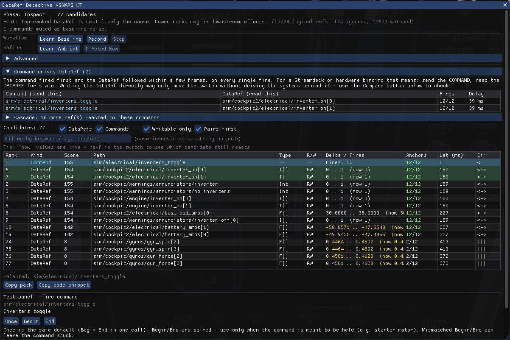
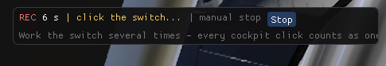

# DataRef Detective

An X-Plane 12 plugin that finds the `sim/...` DataRef driving a cockpit switch
**by behavioural correlation**, not by name.



## Why

Some aircraft do not register their own branded DataRefs. Instead they repurpose unused default `sim/...`
DataRefs as storage cells for custom switches. Observed real examples:

| Cockpit function | Repurposed DataRef                                            |
|------------------|---------------------------------------------------------------|
| Fuel Cut         | `sim/cockpit2/engine/actuators/mixture_ratio_all`             |
| Trim AD          | `sim/cockpit/switches/water_scoop`                            |
| Bus Tie          | `sim/cockpit2/pressurization/actuators/bleed_air_mode`        |
| AUX Bat          | `sim/cockpit/electrical/battery_array_on[1]`                  |

The name is meaningless and actively misleading, so name-based search (the way
DataRefTool works) fails completely. DataRef Detective sidesteps the problem:
it watches **every** DataRef and finds which one changed in correlation with
the switch you just flipped.

## How it works — three phases

Open the window via **Plugins → DataRef Detective**, or bind the command
`xp_sherlock_dataref/window/toggle`.

The controls are grouped so first-time users only ever see two short rows:

- **Workflow** — the main sequence: **Take Snapshot → Record → Stop**.
- **Refine** — optional helper: **Mark Noise** (subtract a cascade, see below).
- **Advanced** (collapsed) — baseline length, switch kind (bool / rotary),
  auto-stop, command noise muting, **Reset**, **Re-enumerate**, and the snapshot
  noise-namespace filters.

A **Hint** line in the status bar always names the next step for the current
phase, so you don't have to memorise the order.

### 1. Take Snapshot (Baseline, 5 s by default)

Click **Take Snapshot** while the cockpit is settled (engines off, electrical
off ideally). The plugin samples every DataRef each frame for the window
duration and adds any ref that twitches to an **ignore set** (engine vibration,
voltage drift, animation noise, time, fuel quantity decay, etc.). This is what
later separates real switch events from ambient noise.

Commands are profiled in the same window: any command that fires while you hold
still is muted as noise (see *Refine: command noise muting* below).

**Baseline length** is adjustable under **Advanced** (2–20 s). Raise it on a
chatty aircraft: a command that only re-fires every few seconds can sit out a
short window entirely and escape the filter. On something like the AW139, 10–15 s
profiles far more of the noise than the default.

### 2. Record + act

Click **Record**. The main window **steps out of the way** — it would otherwise
sit between you and the switch — and a slim bar stays in the corner:



Then simply **work the switch with the mouse**. Every cockpit click registers as
one action automatically; the bar counts them live. There is nothing to press,
and no trip back to the window between cycles.

**Repeat several times.** This is the single biggest lever on result quality: one
actuation cannot separate the target from noise that happened to move at the same
moment, but five can — noise does not track five consecutive actuations. Each
action is one more constraint the right answer has to satisfy.

Click **Stop** in the bar when done. Recording also ends a few seconds after your
last action, on a threshold that adapts to your own pace, so it can never cut a
long sequence short.

Mouse-wheel actuations (rotary knobs) count too, coalesced so one flick of the
wheel is one action rather than a dozen.

You never enter a click count — it comes from the actions you actually
performed. Under **Advanced** you only pick the switch *kind*: **Bool**
(alternates back and forth) or **Rotary** (steps one way), the one thing the tool
cannot infer.

### 3. Inspect + Test

The candidate table shows ranked DataRefs:

- **Top of list** → most likely the **cause** (bidirectional tracking, low
  latency after your click, value pattern matches your click sequence).
- **Below** → may be a **downstream effect** (e.g. bus voltage rising as a
  consequence of the breaker being closed) — still shown, but ranked lower.

The Delta column's **`now` value is read live every frame**. After Record stops
you can re-flip the switch and watch which candidate still reacts — its value
moves and turns yellow — a quick way to break ties within a coupled cluster.

Select a candidate and use the Test panel to write a value:

- The plugin first calls `XPLMCanWriteDataRef`.
- A successful write that triggers the cockpit function **confirms** the
  candidate.
- A write that produces no reaction is **inconclusive, not disproven** — the
  ref may still be correct but read-only, or the aircraft's own SASL/Lua logic
  may overwrite it every frame. In that case you cannot drive it from outside
  and should look for an associated Command instead.

Use **Copy path** to copy the raw DataRef path, or **Copy code snippet** to
copy a paste-ready `XPLMFindDataRef("...")` block.

## Refine: Mark Noise (subtract a cascade)

Complex aircraft turn one switch into a *cascade*: flipping GPU power, for
example, lights up dozens of downstream refs (lights, radios, annunciators) that
all correlate with your click and bury the one ref you actually want. **Mark
Noise** subtracts that cascade.

1. Click **Mark Noise**.
2. Drive everything you want **ignored** — e.g. power the bus another way so the
   same lights/radios come on. Every ref that moves is added to the ignore set.
3. Click **Stop Noise**, then **Record** your real target. The shared cascade is
   gone, so only the switch's own ref stands out.

It is **target-blind**: you never need to know which ref is the target, only how
to reproduce the noise. Captures are **additive** — repeat Mark Noise to keep
narrowing — and the status bar shows how many refs are currently excluded.
Together with the live `now` values above, this turns a 120-candidate cascade
into a short, checkable shortlist.

## Refine: command noise muting

Some aircraft fire commands **continuously, with no user input at all**. The
AW139 is a clear example: `sim/autopilot/disconnect/...` keeps triggering while
you sit still, and every record run is flooded with it. Name-based tools hit the
same wall.

Command muting handles this the same way the baseline handles ambient DataRefs:

- Any command that fires (`Begin`) while you hold still during **Learn Baseline**
  or **Learn Ambient** is muted.
- Muted commands **are still recorded in full**. They are moved out of the main
  table into the collapsible **Muted as baseline noise** section beneath it,
  which shows each command's baseline fire count next to its record fire count.
- **Unmute** on any row moves it straight back into the main list, with its
  complete fire history intact. Nothing is discarded, so a mute can never lose
  the answer.

Baseline is **resetting** (it clears the mute set, like it clears the DataRef
ignore set); Learn Ambient is **additive** (it grows both).

### Auto-unmute

A muted command is brought back automatically — marked `Command *` with an
explanatory tooltip — when it stops behaving like noise during Record:

- its fires cluster around your recorded actions (*median* latency
  ≤ 250 ms, not just a lucky minimum), **and**
- its fire count stays within the expected click budget.

Both criteria are needed. A constant chatterer eventually lands near an anchor by
chance, but its median latency stays large and it far overshoots the click
budget — which is exactly what keeps the AW139 disconnect commands muted.

**Honest limit:** without a single recorded action there is no evidence to
reason from, so nothing is auto-unmuted. Set anchors, or unmute by hand.

The whole feature can be switched off under **Advanced → Mute commands that fire
during baseline**, which restores the previous behaviour exactly.

## Command or DataRef? (actuator vs. indicator)

A cockpit switch usually has **two** correlating entries: a command and a
DataRef. For `sim/cockpit/electrical/battery_on` and
`sim/electrical/batteries_toggle`, which one belongs on your Streamdeck?

Almost always: **send the command, read the DataRef.** The DataRef is typically
the aircraft logic's *status output*, not its input. Writing it may be
overwritten on the next frame, or it may move the switch graphic while the
systems behind it (relays, buses, annunciators) never notice.

The tool now shows this directly instead of leaving you to guess.

### Command drives DataRef

After Record, a **Command drives DataRef** panel appears above the results
whenever a command fired first and a DataRef followed within a few frames — on
**every single fire**. Partial agreement is rejected as coincidence.

```
Command (send this)                DataRef (read this)                  Fires  Delay
sim/electrical/batteries_toggle    sim/cockpit/electrical/battery_on    3/3    18 ms
```

Ordering is the evidence: the command is the cause, the DataRef is the effect.
Rows are sorted by delay, so the tightest coupling — the switch's own state ref
— comes first, with slower downstream consequences below it.

### Compare: cascade probe

The **Compare** block in the test panel settles it by measurement. Each probe
performs one action and counts how many watched refs move within 1.5 s:

1. **Probe: fire command** — runs the aircraft's own logic, so the full cascade
   follows.
2. **Probe: write DataRef** — may only move the switch itself.

If the command moves clearly more refs, the DataRef is just the tip and you must
send the command. If both move the same number, writing is equivalent *for the
refs watched in that Record*.

Both probes are needed before a verdict is shown — half a comparison is not
evidence. Run them from the same starting switch position, otherwise you are
comparing an ON transition against an OFF one.

### The Reacted column — cause before effect

When a switch has **no command** behind it, the pairing above cannot help, and
every ref in its cascade correlates with your click equally well: same coverage,
same latency band, near-identical scores. That is why the right answer tends to
land somewhere in the top ten rather than at the top.

What still separates them is **order**. Clicking a switch starts a chain — the
switch's own state ref moves first, and the bus voltages, lamps and annunciators
it drives move after it:

```
your click
  → sim/cockpit/.../switch_pos    1st 16ms   ← the cause
  → some/bus_voltage              +50 ms     ← effect
  → some/warn_lamp                +83 ms     ← effect of the effect
```

The **Reacted** column shows the median delay from your action to that ref
starting to move, with the earliest marked `1st` in green. Ranking gives earlier
refs a bonus that decays over ~100 ms.

Two things make this measurable now: your action timestamp is the cockpit click
itself rather than a button pressed beforehand, and the measurement uses the
moment a value *starts* moving, not the moment the change is confirmed — the
confirmation delay is identical for every ref and would erase the few-frame gaps
this depends on.

**Being first is evidence, not proof.** The bonus deliberately ranks below
bidirectional tracking and anchor coverage, so a ref that merely twitched early
cannot outrank one that actually followed the switch both ways across every
actuation. And when a whole cascade completes inside a single frame, the
resolution is simply not there — then you get a tied group rather than a winner.
Nothing is hidden either way: the followers stay in the list, just lower.

### The Anchors column

Every candidate shows how cleanly it answered the actions you performed,
e.g. `3/3` in green for a perfect match. One event per anchor and nothing
outside them is the signature of the real target.

This is the strongest filter available, and **it gets stronger the more times
you work the switch**. A single flip cannot separate a target from noise that
happened to move at the same moment; five flips can — noise does not track five
consecutive actuations. If the list is still ambiguous, do another Record with
more repetitions rather than staring at the scores.

Events that belong to no anchor at all count as strays and cost the candidate
score. With no anchors placed, the column reads `--` and coverage is not scored.

## Honest caveats (v1)

- **DataRef enumeration is not exhaustive.** Plugins may register DataRefs
  lazily. Use **Re-enumerate** after an aircraft swap.
- **Phase 3 has asymmetric semantics.** A successful write confirms; a silent
  write does not disprove. The UI says so explicitly.
- **Multi-typed refs.** A ref reporting Int + Float + Double is sampled under
  one canonical type (priority `Int > Float > Double`). Reading under a wrong
  type doesn't help.
- **String / byte (`xplmType_Data`) refs are skipped in v1.** They're counted
  and logged at enum time.
- **Command coverage depends on finding names, not on the SDK.** The XPLM 4.3
  SDK has no generic command-enumeration API — a command can only be looked up
  by name. Names are therefore harvested from four sources and each is verified
  with `XPLMFindCommand`:
  1. X-Plane's `Resources/plugins/Commands.txt` (stock commands)
  2. `<aircraft>/*_Commands.txt`, where it exists (a Zibo-style convention)
  3. **`ATTR_manip_command*` in the aircraft's `.obj` files** — the X-Plane
     standard for clickable cockpit surfaces, so this is where switch commands
     actually live, regardless of vendor
  4. **Registration calls in `.lua`/`.slua` scripts** (`create_command`,
     `find_command`, `sasl.createCommand`, …), covering xlua, SASL and
     FlyWithLua alike

  Sources 3 and 4 exist because most aircraft ship no command list at all and
  register everything at runtime. Check the `Aircraft assets scanned:` line in
  `Log.txt` to see what each channel contributed. A command whose name appears
  nowhere on disk still cannot be watched — so a missing candidate does not
  prove the switch has no command behind it.
- **A ref that moved during the baseline is dropped from the whole recording.**
  It then appears in no table and no ranking. Use **Advanced → Find a missing
  DataRef** to check whether a ref you expected was excluded as noise, and
  re-run the baseline without disturbing it if so.
- **A cascade probe only covers watched refs.** It compares against the refs
  from the last Record, so anything the baseline filtered out as ambient noise
  is invisible to it. "Both moved the same number" means *no measurable
  difference among the refs being watched*, not proof of equivalence.
- **Command→DataRef links are correlational.** They require every fire to be
  followed by a reaction within ~150 ms, which is strong evidence of causation
  but not proof: a third party driving both would look identical.
- **Muted commands are excluded from ranking positions, not from capture.** A
  command muted as baseline noise still records every fire; it is only moved out
  of the main table. Auto-unmute needs at least one recorded action —
  without anchors, a wrongly muted command stays muted until you unmute it.

## Build (macOS, Apple Silicon)

```sh
make setup        # downloads X-Plane SDK 4.3.0, Dear ImGui 1.91.9,
                  # nlohmann/json, Catch2 — first run only
make build        # universal arm64 + x86_64 .xpl
make test         # SDK-free unit tests for change-detector + correlator
make install      # codesign + copy to:
                  #   $(XPLANE_ROOT)/Resources/available plugins/xp_sherlock_dataref/mac_x64/
```

`XPLANE_ROOT` defaults to `/Users/robertw/X-Plane 12` — edit the `Makefile`
if yours differs.

After `make install`, activate the plugin via XLauncher and restart X-Plane.

## Verification (T-6A Fuel Cut)

1. Load the T-6A cold-and-dark on the ramp.
2. Open the window, click **Take Snapshot**, hold still for the baseline window.
3. Click **Record** (the window steps aside), then flip **Fuel Cut** with the
   mouse: OPEN → CUTOFF → OPEN → CUTOFF → OPEN. The bar should count five
   actions — more cycles, sharper coverage. Click **Stop**.
4. Expected top candidate:
   `sim/cockpit2/engine/actuators/mixture_ratio_all`, Float, Δ ~0.0 → 1.0,
   bidirectional, **Anchors 5/5** in green, latency under 100 ms.
5. Select it, set value `0.0`, click **Write** — cockpit Fuel Cut animates to
   CUTOFF. Set `1.0`, **Write** — animates back.

## Project layout

```
src/
  main.cpp              # plugin lifecycle, menu, command
  ui.cpp/.hpp           # ImGui window (mirrors xp_pilot logbook_ui pattern)
  recorder.cpp/.hpp     # phase state machine, flight-loop sampling
  dataref_index.cpp/.hpp# SDK enumeration, type info, array expansion, R/W
  correlator.cpp/.hpp   # PURE ranking — zero SDK, fully unit-testable
  change_detector.hpp   # PURE epsilon-hold FSM
  clipboard.cpp/.hpp    # macOS pbcopy / Win OpenClipboard
  types.hpp             # shared SDK-free types
tests/
  test_smoke.cpp
  test_change_detector.cpp
  test_correlator_ranking.cpp
```

The plugin reuses the architecture of the sibling project `xp_pilot` — same
Makefile / CMake / clang-format / ImGui-on-OpenGL2 setup — so contributors
familiar with one will recognise the other immediately.

## License

See `LICENSE`.
