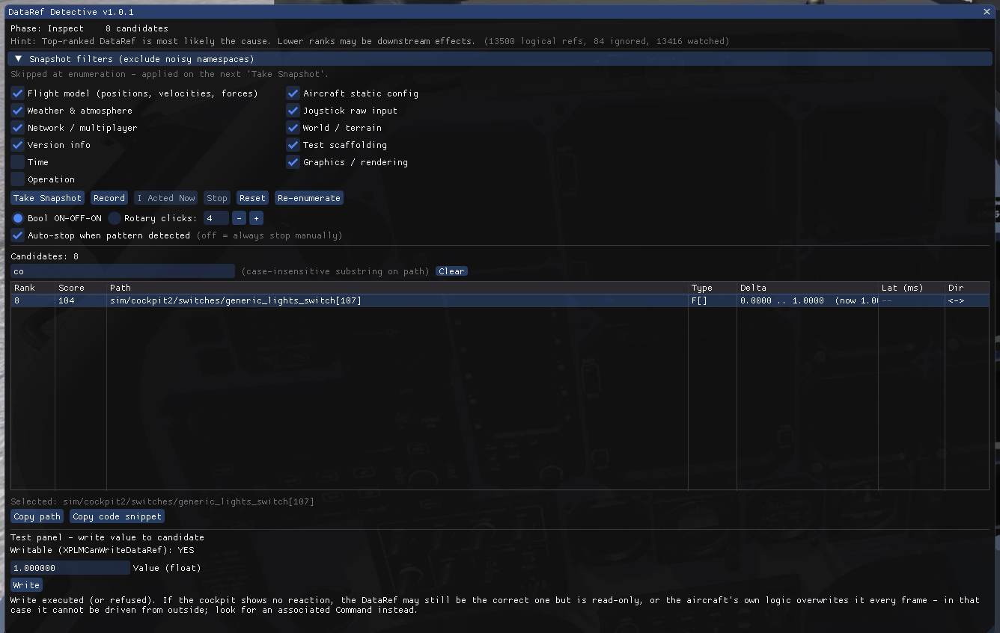

# DataRef Detective

An X-Plane 12 plugin that finds the `sim/...` DataRef driving a cockpit switch
**by behavioural correlation**, not by name.



## Why

Some aircraft do not register their own branded DataRefs. Instead they repurpose unused default `sim/...`
DataRefs as storage cells for custom switches. Observed real examples:

| Cockpit function | Repurposed DataRef                                            |
|------------------|---------------------------------------------------------------|
| Fuel Cut         | `sim/cockpit2/engine/actuators/mixture_ratio_all`             |
| Trim AD          | `sim/cockpit/switches/water_scoop`                            |
| Bus Tie          | `sim/cockpit2/pressurization/actuators/bleed_air_mode`        |
| AUX Bat          | `sim/cockpit/electrical/battery_array_on[1]`                  |

The name is meaningless and actively misleading, so name-based search (the way
DataRefTool works) fails completely. DataRef Detective sidesteps the problem:
it watches **every** DataRef and finds which one changed in correlation with
the switch you just flipped.

## How it works — three phases

Open the window via **Plugins → DataRef Detective**, or bind the command
`xp_sherlock_dataref/window/toggle`.

### 1. Take Snapshot (Baseline, ~2.5 s)

Click **Take Snapshot** while the cockpit is settled (engines off, electrical
off ideally). The plugin samples every DataRef each frame for the window
duration and adds any ref that twitches to an **ignore set** (engine vibration,
voltage drift, animation noise, time, fuel quantity decay, etc.). This is what
later separates real switch events from ambient noise.

### 2. Record + act

Click **Record**, then for each transition:

1. Click **I Acted Now** (stamps a user-action timestamp).
2. Flip the switch.

For a bool switch the brief guides you through **OFF → ON → OFF**. For a rotary
switch, click as many times as the switch has positions. Recording auto-stops
when at least one ref has tracked the change in **both directions** (i.e. a
real switch pattern, not a stray noise event). You can also click **Stop** at
any time.

### 3. Inspect + Test

The candidate table shows ranked DataRefs:

- **Top of list** → most likely the **cause** (bidirectional tracking, low
  latency after your click, value pattern matches your click sequence).
- **Below** → may be a **downstream effect** (e.g. bus voltage rising as a
  consequence of the breaker being closed) — still shown, but ranked lower.

Select a candidate and use the Test panel to write a value:

- The plugin first calls `XPLMCanWriteDataRef`.
- A successful write that triggers the cockpit function **confirms** the
  candidate.
- A write that produces no reaction is **inconclusive, not disproven** — the
  ref may still be correct but read-only, or the aircraft's own SASL/Lua logic
  may overwrite it every frame. In that case you cannot drive it from outside
  and should look for an associated Command instead.

Use **Copy path** to copy the raw DataRef path, or **Copy code snippet** to
copy a paste-ready `XPLMFindDataRef("...")` block.

## Honest caveats (v1)

- **DataRef enumeration is not exhaustive.** Plugins may register DataRefs
  lazily. Use **Re-enumerate** after an aircraft swap.
- **Phase 3 has asymmetric semantics.** A successful write confirms; a silent
  write does not disprove. The UI says so explicitly.
- **Multi-typed refs.** A ref reporting Int + Float + Double is sampled under
  one canonical type (priority `Int > Float > Double`). Reading under a wrong
  type doesn't help.
- **String / byte (`xplmType_Data`) refs are skipped in v1.** They're counted
  and logged at enum time.
- **Command sniffing is NOT implemented in v1.** The XPLM 4.3 SDK has no
  generic command-enumeration API, so we cannot watch all commands. When no
  DataRef correlates, the UI reports "likely Command-based or internal aircraft
  logic" — the only honest answer in that case.

## Build (macOS, Apple Silicon)

```sh
make setup        # downloads X-Plane SDK 4.3.0, Dear ImGui 1.91.9,
                  # nlohmann/json, Catch2 — first run only
make build        # universal arm64 + x86_64 .xpl
make test         # SDK-free unit tests for change-detector + correlator
make install      # codesign + copy to:
                  #   $(XPLANE_ROOT)/Resources/available plugins/xp_sherlock_dataref/mac_x64/
```

`XPLANE_ROOT` defaults to `/Users/robertw/X-Plane 12` — edit the `Makefile`
if yours differs.

After `make install`, activate the plugin via XLauncher and restart X-Plane.

## Verification (T-6A Fuel Cut)

1. Load the T-6A cold-and-dark on the ramp.
2. Open the window, click **Take Snapshot**, wait 2.5 s untouched.
3. Click **Record**. For each transition, click **I Acted Now** then flip
   **Fuel Cut**: OPEN → CUTOFF → OPEN.
4. Expected top candidate:
   `sim/cockpit2/engine/actuators/mixture_ratio_all`, Float, Δ ~0.0 → 1.0,
   bidirectional, latency under 100 ms.
5. Select it, set value `0.0`, click **Write** — cockpit Fuel Cut animates to
   CUTOFF. Set `1.0`, **Write** — animates back.

## Project layout

```
src/
  main.cpp              # plugin lifecycle, menu, command
  ui.cpp/.hpp           # ImGui window (mirrors xp_pilot logbook_ui pattern)
  recorder.cpp/.hpp     # phase state machine, flight-loop sampling
  dataref_index.cpp/.hpp# SDK enumeration, type info, array expansion, R/W
  correlator.cpp/.hpp   # PURE ranking — zero SDK, fully unit-testable
  change_detector.hpp   # PURE epsilon-hold FSM
  clipboard.cpp/.hpp    # macOS pbcopy / Win OpenClipboard
  types.hpp             # shared SDK-free types
tests/
  test_smoke.cpp
  test_change_detector.cpp
  test_correlator_ranking.cpp
```

The plugin reuses the architecture of the sibling project `xp_pilot` — same
Makefile / CMake / clang-format / ImGui-on-OpenGL2 setup — so contributors
familiar with one will recognise the other immediately.

## License

See `LICENSE`.
